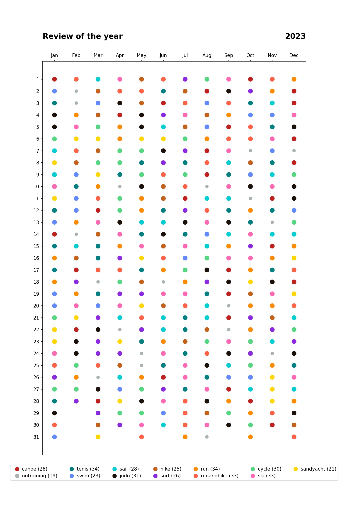

# Colorful Sports Report

Welcome to the Colorful Sports Report, a Python program that helps you visualize all your sports activities for the year in colorful calendar format!

## Purpose

The purpose of this program is to provide a quick and easy way to see all your sports activities for the year at a glance. With this program, you can easily identify patterns in your activity levels, track your progress over time, and visualize your achievements.

## Installation

1. Clone the git repository:

    `git clone https://github.com/username/sports-calendar-heatmap.git`

2. Navigate to the project directory:

    `cd sports-calendar-heatmap`

3. Create and activate a virtual environment:

    `python -m venv venv`  
    `source venv/bin/activate`

4. Install the requirements:

    `pip install -r requirements.txt`

## Usage

To use the Colorful Sports Report, you will need to provide a CSV file containing your sports activities data. An example `sports_activities.csv` file can be found in the root of the project directory.

Run the program with the following command:

`python calendar_heatmap.py`

The program will generate an image of the calendar heatmap based on your sports activities data and save it to the file named `calendar_heatmap.png`.

- - -

